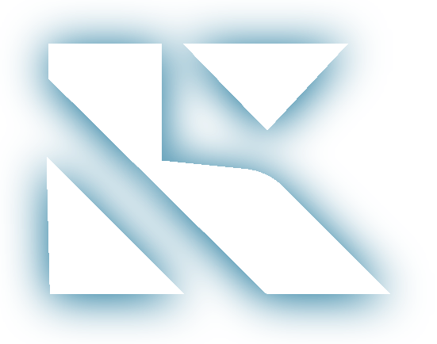

# 🔐 KeyNShare: Secure Decentralized Data Marketplace

<div align="center">
  
  <br/>
  <strong>Empowering data creators with secure, transparent, and anti-piracy dataset exchange</strong>
</div>

<div align="center">
  
[](https://nextjs.org/)
[](https://solana.com/)
[](https://ipfs.tech/)
[](https://nodejs.org/)
[](https://expressjs.com/)

</div>

## 🌟 Project Vision

In a world driven by data, centralized platforms leave creators vulnerable to theft, unfair profit-sharing, and a lack of control. KeyNShare redefines the data economy by empowering data owners and buyers with trustless, code-enforced, and auditable transactions.

## ✨ Features

- **🔒 Secure Data Exchange**: End-to-end encryption for dataset protection
- **⛓️ Blockchain Verification**: Transparent ownership and transaction records on Solana
- **💰 Fair Monetization**: Direct creator compensation without intermediaries
- **🔑 Key Management**: Secure key generation and distribution system
- **📊 Dataset Marketplace**: Browse, purchase, and manage datasets
- **👤 User Profiles**: Manage your datasets, purchases, and preferences
- **📱 Responsive Design**: Beautiful UI that works across devices

## 🏗️ Architecture

KeyNShare consists of three main components:

1. **Frontend (Next.js)**: Modern React application with TypeScript
2. **Backend (Express)**: RESTful API server for business logic
3. **Blockchain (Solana)**: Smart contracts for dataset metadata and ownership

## 📚 Documentation

- [API Documentation](./server/README.md) - Complete reference for the KeyNShare API endpoints
- [Client Documentation](./client/README.md) - Guide for the Next.js client application

## 🚀 Getting Started

### Prerequisites

- Node.js (v18+)
- PNPM (for client)
- NPM (for server)
- Rust and Solana CLI (for blockchain development)

### Installation

#### Clone the repository

```bash
git clone https://github.com/keynshare/Key-N-Share.git
cd Key-N-Share
```

#### Frontend Setup

```bash
cd client
pnpm install
pnpm dev
```

#### Backend Setup

```bash
cd server
npm install
npm run dev
```

#### Blockchain Setup

```bash
cd dataset_metadata
npm install
# Deploy the program to a local Solana validator
npm run deploy:local
```

## 🤝 Contributing

We welcome contributions from the community! Please see our [Contributing Guidelines](./CONTRIBUTING.md) for details on how to get started, coding standards, and the pull request process.

## 📝 License

This project is licensed under the MIT License - see the LICENSE file for details.

## 🙏 Acknowledgments

- The Solana ecosystem for blockchain infrastructure
- IPFS for decentralized storage solutions
- The open-source community for various libraries and tools

---

<div align="center">
  <p>Built in India with ❤️ by the KeyNShare Team </p>
</div>
